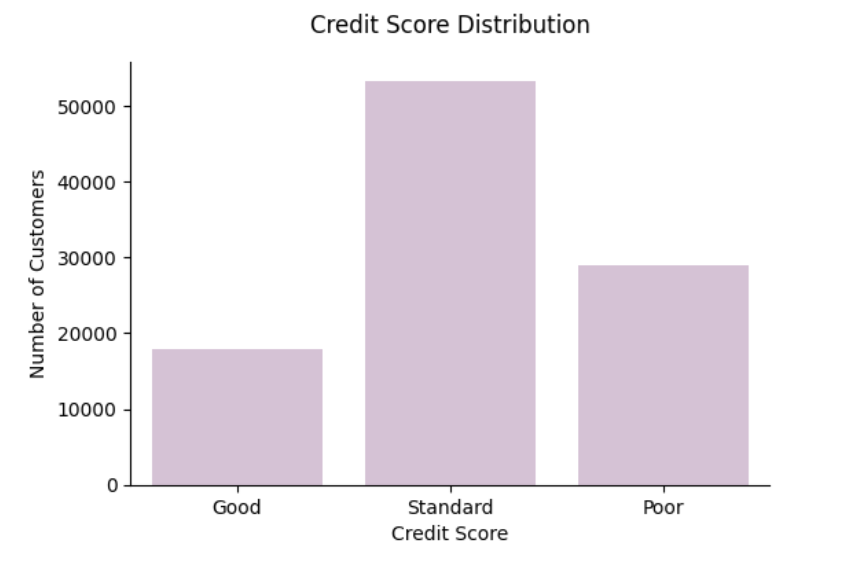
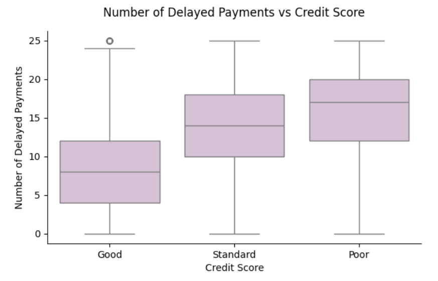
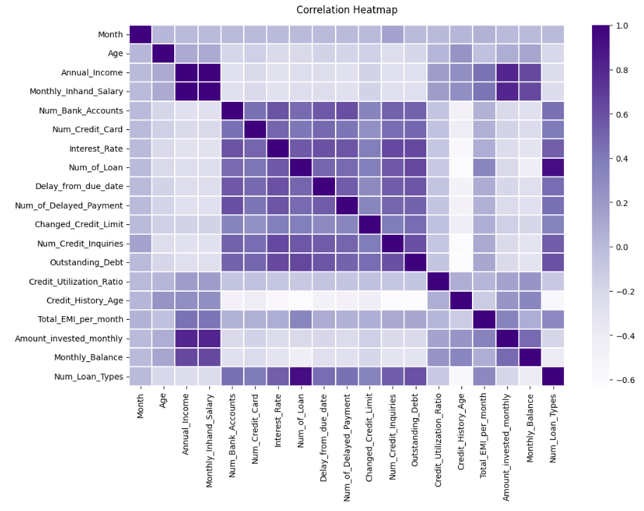
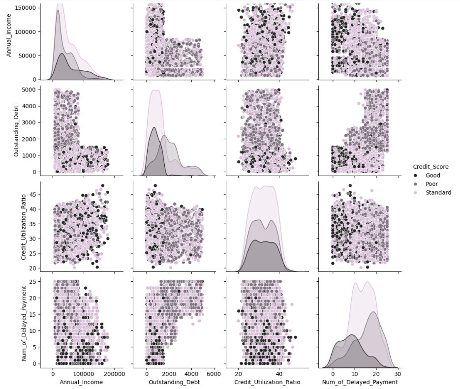

# 📊 Paisabazaar Credit Score EDA | Customer Credit Risk Insights

## 🔎 Project Overview
Paisabazaar handles large-scale customer credit and financial data, but it is not always clear which customer behaviors and financial attributes truly differentiate **Good**, **Standard**, and **Poor** credit profiles.

This project performs **Exploratory Data Analysis (EDA)** to identify the key factors linked with different credit score categories and support **more consistent credit assessment** and **risk-aware decision-making**.

---

## 🧩 Problem Statement
Paisabazaar has access to detailed customer credit and financial data, but lacks clear visibility into which customer behaviors and financial attributes differentiate good, average, and poor credit profiles.

This project explores and analyzes credit-related data to identify the key factors associated with different credit score categories, supporting more consistent credit assessment and risk-aware decision-making.

---

## 🎯 Business Objectives
- Analyze customer credit and financial data to understand how behavioral and financial attributes vary across different credit score categories  
- Identify the key factors linked with **Good, Standard, and Poor** credit profiles to support informed credit assessment  
- Provide data-driven insights to assist Paisabazaar’s credit and risk teams in improving credit evaluation and product recommendations  

---

## 📂 Dataset Summary
- **Rows:** 100,000  
- **Columns:** 28  
- **Target Variable:** `Credit_Score` *(Good / Standard / Poor)*  
- **Missing Values:** 0  
- **Duplicate Records:** 0  

---

## 🧹 Data Wrangling & Cleaning
The dataset was prepared for analysis through the following steps:
- Corrected data type inconsistencies (float ➝ int for count-based fields)
- Converted identifier columns (`Customer_ID`, `SSN`, `ID`) to object type
- Cleaned and standardized the multi-valued `Type_of_Loan` column
- Created an additional feature: `Num_Loan_Types`
- Validated dataset consistency after preprocessing (shape and dtypes)

---

## 📈 EDA Approach (UBM Framework)
The visualization workflow follows a structured **UBM** approach:

### U — Univariate Analysis
- Distribution of target and key numerical features  
- Customer segmentation overview  

### B — Bivariate Analysis
- Numerical vs Credit Score (boxplots)
- Categorical vs Credit Score (countplots / stacked charts)
- Numerical vs Numerical (scatter / density plots)

### M — Multivariate Analysis
- Correlation heatmap
- Pair plot
- Multi-feature segmentation visuals

---

## 📊 Visual Results

### 1) Credit Score Distribution

---

### 2) Key Univariate Charts

---

### 3) Key Bivariate Relationship Charts

---

### 4) Correlation Heatmap

---

### 5) Pair Plot (Multivariate View)

---

## Key Insights

- **Standard is the biggest segment (~53%)**, so Paisabazaar can create the highest business impact by improving decisions and offers for this group instead of focusing only on extreme Good/Poor customers.  

- **Payment behavior is the strongest risk signal** — *Poor* customers show much higher delayed payments (**median ~17–18**) vs *Good* (**~7–8**), making it the best variable for early warning and stricter credit rules.  

- **Debt + Loan exposure indicates credit stress** — customers with more active loans (**Poor median ~5 vs Good ~2**) and higher outstanding debt are consistently linked with weaker scores, supporting stronger limit control and risk-based approvals.  

- **Credit mix is a clean segment separator** — *Good credit mix → Good score* and *Bad credit mix → Poor score*, making it useful for consistent profiling and better product recommendations.  

---

## Business Recommendations
- Prioritize **repayment behavior signals** (delays, due-date patterns) while assessing credit risk
- Apply a **Debt Stress Check** using outstanding debt + loan exposure to reduce default risk
- Focus on uplifting the **Standard** segment using structured credit upgrades and risk-aware product recommendations

---

## 🏁 Conclusion
This EDA provides clear drivers behind credit score classification and supports Paisabazaar in improving **credit assessment consistency**, reducing **risk of defaults**, and enabling **data-driven product recommendations**.

---

## 🛠 Tools & Technologies
- Python  
- Pandas, NumPy  
- Matplotlib, Seaborn  
- Google Colab  

---

## 👤 Author
**Mukul**  
Data Analyst | SQL | Python | EDA | Power BI  

